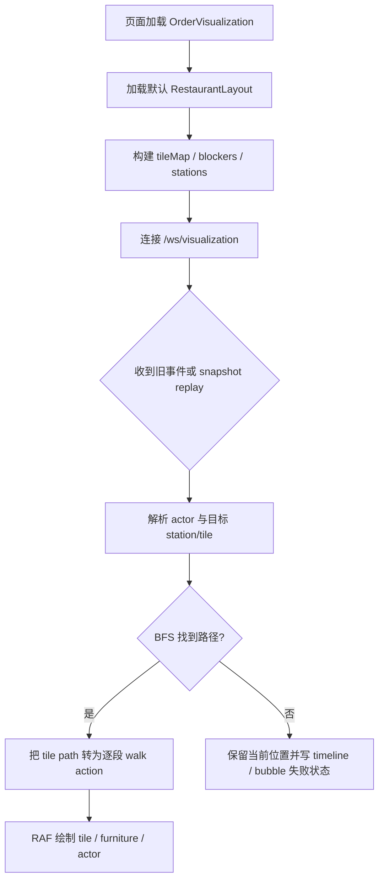

# layout-engine-minimal-loop design

## 0. 术语约定

- `RestaurantLayout`：餐厅网格布局值对象，包含 `cols` / `rows` / `tile_size` / `tiles` / `furniture` / `stations`。防冲突结论：当前生产代码没有同名实现，roadmap 中的同名契约是本 feature 的输入。
- `tile`：布局网格中的一个格子，用 `{col,row}` 表达；像素坐标只作为渲染输出，不再作为业务移动目标。
- `walkable tile` / `blocked tile`：可通行 / 不可通行格子。`wall`、`void` 与家具占用足迹默认不可通行。
- `station`：业务阶段目标点，如 `entrance`、`counter`、`cashier`、`table`、`pickup`、`exit`。防冲突结论：现有代码用固定 `points` 表达这些位置，本 feature 把它们迁移到 layout 的 `stations`。
- `actor`：画布里的可移动角色，覆盖现有 agent/customer/presence visitor。防冲突结论：现有代码名词是 `character`，design 用 `actor` 表达布局层概念，实现时保留 `character` 内部结构也可接受。
- `RestaurantSceneCore`：新增前端布局/寻路计算入口，挂到 `window` 下供现有静态脚本消费。防冲突结论：当前代码和文档未使用该名称。
- `OrderVisualization`：既有页面公共 API，`index.html` 和 `screen.html` 依赖 `window.OrderVisualization`。本 feature 必须保持这个 API 可用。

## 1. 决策与约束

需求摘要：在不改变 FastAPI、MySQL、Redis、订单、支付和 A2A Skill 边界的前提下，让当前静态餐厅可视化先跑通最小布局闭环。打开 `/screen` 或首页可视化区域时，浏览器使用默认 `RestaurantLayout` 渲染餐厅网格、家具和角色；现有 `restaurant.*`、`agent.action`、`presence.*` 事件进入前端后，被转换为 station/tile 目标，并通过 walkable tile BFS 路径驱动角色移动。

明确不做：

- 不新增 `GET/PUT /visualization/layout`、`restaurant_layout`、`scene_actor_state`，不写 MySQL 迁移脚本。
- 不引入 React/Vite/TypeScript 构建链，不直接迁移 VS Code extension 或 pixel-agents server。
- 不替换 A2A Skill 点单入口，不改订单创建、支付、余额和 token 鉴权逻辑。
- 不迁移 PNG/sprite asset catalog；本轮仍使用现有手绘 canvas primitives。
- 不把后端 `scene.snapshot` 扩展为 layout/actors 当前事实状态；本轮继续兼容只包含 `events` 的 snapshot。

复杂度档位偏离：

- `Structure = modules`（偏离内部工具默认 `functions`）：现有 `app/static/order-visualization.js` 已接近 1900 行，本 feature 的布局、寻路和坐标转换应落到新静态脚本，现有文件只做事件适配和渲染接入。
- `Compatibility = backward-compatible`：`window.OrderVisualization.create/emit/subscribe/handleChatResult/isRealtimeConnected` 继续可用，首页和大屏页面不改调用方式。
- `Determinism = deterministic`：同一 layout、actor key、目标 station 必须得到稳定路径；不可达时不能随机穿墙或瞬移。

关键决策：

1. 保持静态 HTML/JS 形态。pixel-agents 的 React/Vite 架构只迁移 layout/path/render 思路，不引入前端构建链。
2. 第一阶段使用内置默认 layout。持久化、revision、layout API 放到后续 `layout-persistence-api`，避免把前端闭环和 MySQL schema 变更绑在一起。
3. 事件协议保持旧形态。前端先把旧事件映射成布局动作，后端 `scene.command` 等到后续 `scene-command-protocol` 再统一。
4. 新计算默认放新文件。BFS、tile map、station target、tile/pixel 转换属于可独立测试的计算层，不继续堆进现有大文件。

前置依赖：无。roadmap item `layout-engine-minimal-loop` 依赖为空，是最小闭环条目。

## 2. 名词与编排

### 2.1 名词层

现状：

- `app/static/order-visualization.js` 定义固定 `points` 和 `sceneObjects`，`point(name)` 把 station 名称映射为像素坐标。
- 同一文件的 `walkTo(character, action)` 对当前像素位置和目标像素位置做直线插值，路径不理解墙、家具或不可通行区域。
- `handleBackendEvent(message, fromSnapshot)` 直接消费 `scene.snapshot`、`agent.action`、`restaurant.*`、`presence.*`，并把它们转成现有 queue action。
- `app/services/visualization_service.py` 的 `VisualizationHub.connect()` 发送 `scene.snapshot`，payload 只有最近 `events`，没有 layout 或 actor 当前事实状态。

变化：

- 新增前端 `RestaurantLayout` 默认值：包含布局尺寸、tile 数组、家具足迹、station 坐标。它是当前 roadmap 4.1 契约的前端子集，不包含 `layout_id/revision` 持久化字段。
- 新增前端 `RestaurantSceneCore`：负责 `createDefaultLayout()`、`buildRuntime(layout)`、`findPath(fromTile,toTile)`、`stationTarget(station,actorKey)`、`tileToPoint(tile)` 等布局计算。
- 扩展现有 character 运行时语义：角色可继续拥有 `position` 像素坐标，但移动目标先解析为 tile path，再逐段转换成像素中心点。
- 保留 `OrderVisualization` 对外 API；页面仍通过 `window.OrderVisualization.create(...)` 初始化。

接口示例：

```javascript
// 来源：新增静态前端布局计算入口
const layout = window.RestaurantSceneCore.createDefaultLayout();
const runtime = window.RestaurantSceneCore.buildRuntime(layout);
const target = runtime.stationTarget("counter", "agent:1");
const path = runtime.findPath({ col: 3, row: 18 }, target.tile);
// path: [{ col: 4, row: 18 }, ..., { col: 23, row: 13 }]
```

```javascript
// 来源：既有 app/static/order-visualization.js OrderVisualization.create
const scene = window.OrderVisualization.create({
  root: document.getElementById("orderViz"),
  canvasWidth: 640,
  canvasHeight: 360,
  localPresence: false
});
// 返回对象的 emit / subscribe / handleChatResult / isRealtimeConnected 继续存在。
```

### 2.2 编排层



现状：当前编排是“WebSocket/本地 emit -> `handleBackendEvent` -> 角色 queue -> `walkTo` 直线移动 -> `drawScene` 固定背景和家具”。这个流程是单文件状态机，坐标目标直接来自固定点或 payload 像素。

变化：在 `handleBackendEvent` 和 queue action 之间插入 layout-aware 解析层。事件仍由现有入口进入，但目标从 station/payload 解析为 `{tile, point}`；移动 action 从“一个目标像素点”变成“若干 tile center 组成的路径段”。`drawScene` 从固定 checker floor 升级为根据 `RestaurantLayout.tiles` 绘制地面/墙/void，再绘制 layout furniture 与 actor。

流程级约束：

- 错误语义：station 缺失、tile 不可达、BFS 无路径时，只影响可视化；订单、聊天、Skill 点单不能失败。
- 顺序约束：同一 actor 继续串行消费 queue，不能因为 path 被拆成多段而让后续事件插队。
- 兼容约束：旧 `scene.snapshot.payload.events` 继续 replay；旧事件没有 tile 字段时必须能通过 station fallback 移动。
- 可观测点：不可达路径要进入 timeline 或角色 bubble，便于肉眼确认“没有穿墙且没有业务阻断”。

### 2.3 挂载点清单

- 静态页面脚本加载：`app/static/index.html` 与 `app/static/screen.html` — 新增 `RestaurantSceneCore` 静态脚本并保证它在 `order-visualization.js` 前加载。
- 公共前端 API 行为：`window.OrderVisualization.create(...)` — 修改为默认启用 layout-aware runtime，同时保留现有返回对象方法。
- 可视化事件消费入口：现有 `scene.snapshot`、`agent.action`、`restaurant.*`、`presence.*` 处理链 — 修改为把事件目标转换成 station/tile path。
- 默认布局 preset：前端内置 `default-restaurant` layout — 新增当前最小闭环使用的布局默认值。

### 2.4 推进策略

1. 静态结构：建立默认 layout 和 layout runtime，页面加载后能画出 tile grid、墙/地面、默认 station 标记。
   退出信号：不连接 WebSocket 也能在 canvas 上看到默认布局。
2. 计算节点：实现 walkable/blocked tile、station target、4 邻接 BFS 和 tile/pixel 转换。
   退出信号：正常路径、被墙阻断、站点缺失三类输入都有可观察结果。
3. 移动编排：把现有 actor queue 接到 path 段移动，保持同一 actor 串行执行。
   退出信号：同一角色连续收到两个移动事件时按顺序走完，不瞬移、不插队。
4. 状态接入：把 `restaurant.customer_entered`、`agent.action`、`presence.customer_moved` 等旧事件映射到 station/tile。
   退出信号：snapshot replay 和实时 WebSocket 事件都能驱动同一套移动逻辑。
5. 渲染收尾：根据 layout 绘制背景/家具层，并保留现有面板、ticket、timeline、Agent 列表。
   退出信号：首页和 `/screen` 页面原有可视化周边 UI 仍正常显示。
6. 验收验证：覆盖正常、边界和反向范围守护。
   退出信号：第 3 节验收场景都有命令、页面或浏览器证据。

### 2.5 结构健康度与微重构

##### 评估

- compound convention：`.codestable/compound` 当前没有 decision/convention 文档，暂无既有目录归属规则可复用。
- 文件级 — `app/static/order-visualization.js`：约 1893 行，混合事件传输、状态机、路径动画、canvas 绘制、本地 presence、右侧面板渲染；本 feature 若直接追加 layout/BFS/坐标计算，会继续扩大职责混杂。
- 文件级 — `app/static/index.html` / `app/static/screen.html`：只需增加静态脚本加载顺序，结构风险低。
- 目录级 — `app/static/`：当前 4 个同层静态文件，本次预计新增 1 个 layout core 脚本，不构成目录摊平。

##### 结论：不做前置微重构

原因：把现有 `order-visualization.js` 拆文件需要“只搬不改行为”的可验证保障，但当前前端没有覆盖这些 canvas/事件行为的测试，先拆会把 feature 风险和重构风险叠加。本 feature 的约束改为：新增布局与寻路计算落在新静态脚本，现有大文件只做必要接入；不在实现前搬迁既有函数。

##### 超出范围的观察

- `app/static/order-visualization.js` 已经适合后续单独走 `cs-refactor`，按事件 transport、scene state、layout/render、panel UI 拆分。但这会改变模块边界，不作为本 feature 前置依赖。

## 3. 验收契约

关键场景清单：

1. 触发：打开 `/screen`。期望：canvas 显示默认餐厅 tile grid、墙/地面、默认家具/station，右侧指标、Recent Orders、Source Stats、Active Agents 仍渲染。
2. 触发：打开首页聊天页面。期望：`window.OrderVisualization` 存在，聊天发送、订单结果 fallback、可视化面板不因新增脚本报错。
3. 触发：WebSocket 初次连接收到仅含 `events` 的 `scene.snapshot`。期望：旧 events 仍 replay；如果包含 `restaurant.customer_entered`，顾客按 layout path 出现在店内，不依赖 snapshot 自带 layout。
4. 触发：收到实时 `restaurant.customer_entered`。期望：顾客 actor 从 entrance/staging tile 沿 walkable path 移动到 table 或当前阶段 station，不直线穿越 wall/blocked tile。
5. 触发：收到 `agent.action` 且 `action_type=walk_to_counter`。期望：对应 agent actor 沿 BFS path 到达 counter station；action message 仍能显示为 bubble/timeline。
6. 触发：启用本地 presence 后点击/移动到画布可通行区域。期望：presence visitor 映射到最近 walkable tile 并移动；点击墙/void 时不会落到不可通行 tile。
7. 触发：构造一个不可达 station 或被 blocker 包围的目标。期望：actor 保持当前位置，timeline 或 bubble 显示路径失败；业务请求和 WebSocket 连接不因此中断。

明确不做的反向核对项：

- 代码中不应新增 `/visualization/layout`、`/visualization/assets/catalog` 路由。
- 数据模型或迁移脚本中不应新增 `restaurant_layout`、`scene_actor_state` 表。
- `package.json` 不应新增 React/Vite/TypeScript 前端构建依赖。
- `.agents/skills/a2a-super-order/` 不应为了本 feature 修改点单/支付主流程。
- 后端响应、日志、页面不应暴露 MySQL、Redis、token、API key 或完整连接串。

## 4. 与项目级架构文档的关系

acceptance 阶段应回写 `.codestable/architecture/ARCHITECTURE.md` 的静态 UI/可视化部分：当前可视化从固定像素点移动升级为“内置默认 `RestaurantLayout` + 前端 BFS path + 现有 WebSocket 事件适配”。同时要明确它仍是前端内存态最小闭环，没有 layout API、MySQL 持久化、后端 actor snapshot 或 scene command 协议；这些仍归 roadmap 后续条目。
