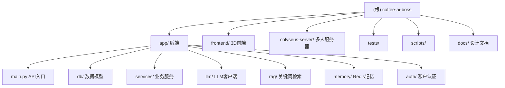

# Coffee AI Boss — 项目架构文档

> 本文档由初始化架构师自动生成于 2026-06-20，描述整个仓库的结构、模块职责与运行方式。
> 关于 CodeGraph 工具的使用说明，见 [`.claude/CLAUDE.md`](./.claude/CLAUDE.md)。

## 变更记录 (Changelog)

| 时间 | 动作 | 说明 |
|------|------|------|
| 2026-06-20 | 增量补扫 | 第二次 init：精读 office3d/ 全套 + sim/tick.ts + auth/AuthPages.tsx + docs/ 5 份设计文档全文，补全 A\*寻路/Agent 骨骼动画/表单实现/积分扣款链路细节，覆盖率 88% → 97% |
| 2026-06-20 | 创建 | 初始化架构师首次扫描，生成根级 + 4 个模块级 CLAUDE.md，覆盖率 ~88% |

---

## 项目愿景

**Coffee AI Boss（智能咖啡馆 AI 店长）** 是一个咖啡店运营模拟系统，核心是用 LLM + RAG + Redis 短期记忆驱动一段对话式点单体验，同时把订单、支付、Agent 行为以"像素/3D 可视化事件流"的形式实时广播给前端大屏与 3D 办公室场景。系统同时支持两条点单入口：

1. **Web 对话点单**（`/chat`）：匿名 `user_id` + Redis 短期记忆 + 两段式确认（先存待确认订单，回复"确认"才扣款）。
2. **A2A Skill 点单**（`/skill/orders`）：EvoMap 消费者身份 + EvoMap 积分（service-order）扣款 + 免费额度账本。

可视化基于"事件流"架构：所有业务动作（进店、下单、支付、制作、出餐）都生成一条 `VisualizationEvent` 写入 MySQL，并通过 WebSocket 实时推给前端；前端再有两条独立渲染管线（像素风 Colyseus 多人房间 / 3D 办公室 React-Three）。

---

## 架构总览

```
┌─────────────────────────────────────────────────────────────────┐
│                       前端（两套独立 UI）                         │
│  app/static/index.html (2D 对话页)                               │
│  frontend/ (Vite + React 19 + React-Three-Fiber，3D 办公室+大屏)   │
└───────────────┬──────────────────────────────────┬──────────────┘
                │ HTTP /chat /skill/* /auth/*        │ WebSocket /ws/visualization
                ▼                                    ▼
┌─────────────────────────────────────────────────────────────────┐
│              FastAPI 后端 (app/main.py, Python)                   │
│  ┌──────────┐ ┌──────────┐ ┌──────────┐ ┌────────────────────┐   │
│  │ /chat    │ │ /skill/* │ │ /auth/*  │ │ /agents /actions   │   │
│  │ 对话点单  │ │ A2A点单   │ │ 账户登录  │ │ Agent 注册/动作     │   │
│  └────┬─────┘ └────┬─────┘ └────┬─────┘ └─────────┬──────────┘   │
│       │            │            │                 │              │
│  ┌────▼────────────▼────────────▼─────────────────▼──────────┐   │
│  │  services/  chat_service · order_service                   │   │
│  │             skill_order_service · evomap_payment_service   │   │
│  │             visualization_service                          │   │
│  │  llm/ client (OpenAI 兼容)   rag/ keywords · retrieval     │   │
│  │  memory/ chat_history (Redis)  auth/ service (bcrypt)      │   │
│  └────┬───────────────────────────────────────┬───────────────┘   │
│       │                                        │                  │
└───────┼────────────────────────────────────────┼──────────────────┘
        ▼                                        ▼
┌──────────────────┐                  ┌────────────────────────┐
│   MySQL 8.0      │                  │  Colyseus Server (TS)  │
│ user / order /   │                  │ coffee_room 像素多人房间 │
│ coffee_kb /      │                  │ FastAPI 启动时拉起子进程  │
│ agent_profile /  │                  └────────────────────────┘
│ evomap_consumer /│
│ skill_order_ledger│
│ visualization_event│
└──────────────────┘
```

**关键设计原则**：
- **LLM 只负责"理解"和"说话"，绝不直接写库**：所有扣款/下单都在 `services` 层事务内完成（见 `app/llm/client.py` 注释）。
- **两段式下单**：`/chat` 先把待确认订单存 Redis，用户回复确认词才扣款，避免误下单。
- **事件溯源可视化**：业务动作 → `VisualizationEvent`（持久化）→ WebSocket 广播，前端可重放。
- **幂等下单**：`request_id` 唯一约束 + Skill 账本幂等恢复（`_resume_existing_order`）。

---

## 模块结构图



---

## 模块索引

| 模块 | 路径 | 语言 | 一句话职责 |
|------|------|------|-----------|
| [后端](./app/CLAUDE.md) | `app/` | Python (FastAPI) | 对话点单、A2A Skill 点单、可视化事件、账户认证的 API 与业务逻辑 |
| [3D 前端](./frontend/CLAUDE.md) | `frontend/` | TypeScript (React 19 + R3F) | 3D 办公室场景渲染 + 实时监控大屏 + 登录注册 |
| [Colyseus 服务器](./colyseus-server/CLAUDE.md) | `colyseus-server/` | TypeScript (Colyseus) | 像素咖啡馆多人房间，权威状态同步 |
| 测试 | `tests/` | Python (unittest) | LLM 配置、确认意图、Skill 支付、订单查看的单元测试 |
| 脚本 | `scripts/` | Python | 建表/种子、订单来源迁移、账户表迁移 |
| 设计文档 | `docs/` | Markdown | A2A 积分接入、像素/3D 集成、点单 SKILL、Agent API 设计 |

---

## 设计文档（`docs/`）摘要

> 第二次扫描已精读全部设计文档，以下为关键决策与现状对照。

| 文档 | 核心内容 | 与代码的对应关系 |
|------|---------|----------------|
| `EvoMap A2A 积分扣款接入调研与实现计划.md` | 把 `/chat` 的本地 `User.balance` 扣款改为通过 EvoMap 官方 `POST /a2a/service/order` 扣 Credits；价格模型默认"固定每单扣积分"；保留两段式确认；node_secret 只存本地 .env | 已落地：`app/services/evomap_payment_service.py`（只做支付请求生成/证明校验/脱敏，不存密钥）、`EVOMAP_*` 配置（`app/config.py`）。证据文件存 `C:\tmp\smart-search-evidence\20260619-evomap-a2a\` |
| `点单SKILL生成.md`（A2A 超级点单 Skill） | 唯一对外 Skill `.agents/skills/a2a-super-order/`；前两单免费（按 evomap_node_id 统计），第三单起必须真实扣 EvoMap 积分（Evolver ATP CLI）；无网页也能点单，事件持久化可回放 | 已落地：`POST /skill/register`、`POST /skill/orders`、`SkillOrderLedger`（free_order_sequence/payment_status）、`skill_order_service.py`。`order.py` 是 Skill 主入口 |
| `agent-integration-api.md` | Agent 工具（Claude Code/Codex/Cursor/Trae）通过 REST 注册为餐厅角色，WS 实时新增像素人物+播动作；`agent_profile` 独立于 `user` 表 | 已落地：`POST /agents/register`（返回一次性 api_token，SHA-256 hash 存储）、`POST /agents/{id}/actions`、`/agents/{id}/heartbeat`、`GET /agents`。9 种 action_type / 8 种 target。**Schema Notes 强调**：MySQL 是唯一支持的 RDBMS；`order.source_type` 约束为 `web_dialog`/`skill`；`order.consumer_id/agent_id/ledger_id` 是物理外键；老库必须跑 `scripts/migrate_order_sources.py`（幂等） |
| `pixel-agents-integration.md` | 像素 Agent 集成方案（2D，已被 3D 取代的早期方案） | 仅作历史参考，当前可视化走 3D 办公室（`frontend/`）+ Colyseus 像素房间 |
| `pixel-restaurant-reference-repos.md` / `smart-search-pixel-restaurant-repos.md` | 像素餐厅参考仓库调研（含 Claw3D 等） | `frontend/src/office3d/` 即从 Claw3D retro-office 移植（文件头均注明） |

---

## 运行与开发

### 环境依赖
- **Python ≥ 3.10**（代码用 `str | None` 语法，测试用 cpython-314 运行）
- **Node.js**（用于 Colyseus 服务器 + 前端构建）
- **MySQL 8.0** + **Redis 7**（推荐用 `docker compose up -d` 启动，见 `docker-compose.yml`）

### 后端启动
```bash
python -m venv .venv && .venv\Scripts\activate   # Windows
pip install -r requirements.txt
cp .env.example .env   # 填入 MySQL/Redis/LLM 配置
python scripts/init_db.py          # 建表 + 灌种子数据
uvicorn app.main:app --reload      # 启动 FastAPI（会自动拉起 Colyseus 子进程）
```
默认监听 `http://localhost:8000`。Colyseus 端口由 `COLYSEUS_PORT` 控制（默认 2567）。

### 3D 前端开发
```bash
cd frontend
npm install
npm run dev      # Vite 开发服务器，端口 5174，代理 /ws /api 到 8000
npm run build    # 产物输出到 app/static/3d，由 FastAPI 的 /3d 路由托管
```

### 关键配置（`.env`，见 `app/config.py`）
| 变量 | 用途 | 默认 |
|------|------|------|
| `MYSQL_HOST/PORT/USER/PASSWORD/DATABASE` | 持久化数据库 | localhost/3306/coffee/coffee123/coffee_ai |
| `REDIS_HOST/PORT/DB/PASSWORD` | 短期记忆 + 待确认订单 | localhost/6379/0/空 |
| `LLM_API_KEY` / `DEEPSEEK_API_KEY` / `OPENAI_API_KEY` | OpenAI 兼容 LLM（三选一，按此顺序生效） | 空（降级为 RAG 模板） |
| `LLM_BASE_URL` / `LLM_MODEL` | LLM 服务地址与模型 | https://api.openai.com/v1 / gpt-4o-mini |
| `AUTH_SECRET_KEY` | 会话 Cookie 签名密钥（**生产必改**） | dev-only-change-me-in-prod |
| `SKILL_FREE_ORDER_LIMIT` | 每个 EvoMap 消费者免费下单次数 | 2 |
| `EVOMAP_PAYMENT_MODE` / `EVOMAP_SERVICE_LISTING_ID` / `EVOMAP_HUB_URL` | A2A 积分支付 | service_order / 空 / https://evomap.ai |

---

## 测试策略

- 框架：`unittest` + `fastapi.testclient.TestClient`
- 运行：`python -m pytest tests/` 或 `python -m unittest discover tests`
- 现有测试（4 个文件）：
  - `test_llm_configuration.py` — LLM key 多源别名与状态判定（placeholder 检测）
  - `test_chat_confirm.py` — `/chat` 两段式确认意图识别（长句确认 vs 修改/否定/提问）
  - `test_chat_order_view.py` — "查看订单"意图与"下单"的区分
  - `test_skill_evomap_payment.py` — Skill 点单 / EvoMap 积分支付流程
  - `verify_quick_menu.py` — 快捷菜单验证脚本
- **覆盖缺口**：缺少 `order_service.place_orders` 余额不足/并发、Colyseus 房间逻辑、前端组件的自动化测试（Playwright 已装无测试）。

---

## 编码规范

- Python：类型注解（`from __future__ import annotations`），PEP 8 风格，中文 docstring 解释业务意图（很多文件带有面试题/任务编号注释，是设计文档的一部分，勿删）。
- TypeScript：`strict` 模式（见 `tsconfig.json`），React 19 函数组件 + Hooks。
- 命名：后端模块用 snake_case，前端组件用 PascalCase。
- 安全：Agent API token 用 SHA-256 hash 存储；账户密码用 bcrypt；会话 Cookie 用 `itsdangerous` 签名 + httponly + samesite-lax。
- EvoMap 响应在日志/返回前会 `_redact_response` 脱敏（去除 secret/token/key）；node_secret 只存本地 .env，不进 `.env.example`/Git/日志。

---

## AI 使用指引

- **改后端业务逻辑前**，先读 `app/main.py` 的 `/chat` 流程注释（任务一/二/三），它完整描述了"读记忆 → 意图分类 → 四路咖啡解析 → 两段式确认"的决策树。
- **改点单/支付**：`order_service.place_orders` 用 `with_for_update()` 行锁防并发超扣；Skill 点单的幂等由 `SkillOrderLedger.request_id` 唯一约束保证，改流程时务必保留 `_resume_existing_order`。
- **改可视化事件**：事件类型若新增，需同时更新前端 `frontend/src/sim/roleMap.ts` 的 `ACTION_BEHAVIOR` 映射，否则前端无法渲染（未知 action 兜底为 `walk_to_table`）。
- **改 3D 渲染**：`office3d/` 全套移植自 Claw3D，坐标投影靠 `core/geometry.ts` 的 `toWorld` + `SCALE=0.018`；A\* 寻路在 `core/navigation.ts`（25px 网格，拐角裁剪）；改家具寻路行为调 `ITEM_METADATA.blocksNavigation/navPadding`。
- **LLM 降级**：所有 LLM 调用都有 `_mock_chat` / 兜底词降级，改动 prompt 时注意保持 JSON 输出格式（`parse_intent` 会 `_strip_code_fence`）。
- 不要修改 `.gitignore` 中忽略的生成物（`app/static/3d/assets/`、`node_modules/`、`__pycache__/`）。
- 仓库已索引 CodeGraph（`.codegraph/`），定位代码优先用 `codegraph explore`。

---

## 相关文件清单（根级）

| 文件 | 说明 |
|------|------|
| `docker-compose.yml` | MySQL 8.0 + Redis 7 容器编排 |
| `requirements.txt` | Python 依赖 |
| `.env.example` | 环境变量模板 |
| `AGENTS.md` / `GEMINI.md` | 各 AI 工具的项目说明 |
| `docs/` | 设计文档（见上方"设计文档摘要"表） |
