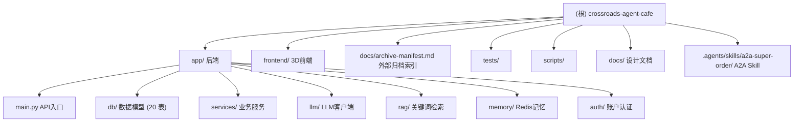

# Crossroads Agent Café — 项目架构文档

> 本文档由初始化架构师自动生成于 2026-06-20，描述整个仓库的结构、模块职责与运行方式。
> 关于 CodeGraph 工具的使用说明，见 [`.claude/CLAUDE.md`](./.claude/CLAUDE.md)。

## 变更记录 (Changelog)

| 时间 | 动作 | 说明 |
|------|------|------|
| 2026-06-28 13:13 | 增量校验（第十次 init） | **颠覆性架构变更 + 用户画像/访客分析/自主顾客/复购四大新功能落地**（仅文档，不改源码；对照第九次 init `031608f` → 当前 HEAD `25ed549`，40+ commit）。① **⚠️ 数据栈本地化**（`a5938db` 2026-06-26，"MySQL server compromised"）：`DB_MODE=sqlite`（默认，`coffee_ai.db` 文件）+ `USE_FAKEREDIS=true`（默认，进程内模拟），**本地零配置无需 MySQL/Redis 服务**；生产仍可切 `DB_MODE=mysql` + `USE_FAKEREDIS=false`。配套 `0abcb08` pin redis-py<6.0.0 修 fakeredis 8s lrange stall、`3a08851` SQLite WAL+PRAGMA + jieba preload + LLM 连接预热、`d11cd1f` 忽略 SQLite WAL 临时文件。② **表数 17→20**：新增 `VisitorInsight`（访客洞察，每用户每天一条，LLM 流失原因分析）、`ChatMessage`（对话持久化归档，画像数据源，`chat_history.add_message` 双写 best-effort）、`UserProfile`（LLM 口味画像摘要，镜像 `User.taste_preference`，增量游标 `last_msg_id`）。③ **新 4 services**：`autonomous_agent_service`（数字顾客自主买咖啡循环，`5dd3ce8`）、`visitor_analytics_service`（访客分析，`4031978`）、`user_profile_service` + `reorder_service`（用户画像 + 复购意图识别，`82e7dd1`）。④ **测试 12→16 文件**：新增 `test_reorder`/`test_review_apology`/`test_user_profile`/`test_schema_consistency_migration`。⑤ **✅ reviewer 遗留 bug 已修**：`chat_with_role` 已加 `timeout_seconds: float | None = None` 形参（`llm/client.py:330`），`reviewer_agent.py:62,76` 调用合法，复盘不再静默失效（很可能就是 `7e7e46b`「修复复盘道歉失效」修的）。⑥ **LLM 超时再调**：`llm_connect_timeout 3→10s`（`653622b`）、`llm_generation_timeout 12→25→40s`（`d432eef`/`4417334`）。⑦ **A2A Skill npm 打包**（`3875347`，支持 `npx` 分发，对应 active task `skill-pre-release-audit`）。⑧ **3D 社交面板 + Today Topics + 移动端响应式 + 暗色主题**（`6506e92`/`4b0b736`/`821948f`）。⑨ 校验通过项（保持不动）：根路由 `/` 登录门槛（`app/main.py` 的 `index()` 仍 302→`/3d/login`）、点单 API 匿名、多 Agent 协作架构、两段式确认、服务员团队编排、事件溯源可视化、Colyseus 归档 no-op。⑩ **代码清理**：目录清理阶段已去重 `main.py` 中重复注册的 `/orders/{user_id}`、`/status`、`/3d`、`/3d/{path}`、`/` 路由，保留单一实现。本次因无 venv 未跑 pytest，passed 数沿用历史。同步更新 app/CLAUDE.md。覆盖率 99% |
| 2026-06-21 09:55 | 增量校验（第九次 init） | **一致性校验 + 补漏**（仅文档，不改源码；对照 HEAD `031608f`）。① **表数校正 16→17**：`app/db/models.py` 实测 17 个 `class X(Base)`，新增**第 17 张表 `office_layout`**（3D 编辑器布局持久化，全局单例 by `namespace`，JSON blob 对齐前端 `FurnitureItem[]`）+ 新 service `app/services/office_layout_service.py`（`get_layout` JSON 损坏降级 None / `save_layout` upsert）+ 新路由 `GET|PUT /api/office/layout`（匿名可读写，遵循无登录门槛原则）。② **`/menu` 路由补录**：`GET /menu` 返回菜单卡片数据（名称/价格/标签/图片/库存），前端 `.menu-card` 消费，走 `get_all_products` 60s 缓存。③ **测试计数校正**：实测 **12 个 pytest 文件**（原"11 文件"漏计 `test_customer_enter_scene.py`，2026-06-21 08:40 新增 2 用例）；`tests/verify_quick_menu.py` 是独立验证脚本非 pytest。无法在本次环境跑 pytest（无 venv/DB），71 passed 数字沿用第八次 init 实测。④ Mermaid 模块图 `db/ 数据模型 (16 表)`→`(17 表)`。⑤ 校验通过项（保持不动）：startup `_ensure_staff_seeded` 不广播、`/3d/sounds` mount 已恢复、根路由 `/` 登录门槛（`d408c58`）、reviewer timeout_seconds 遗留 bug 标注、多 Agent 协作架构、LLM 超时系统重构、2D 聊天页回归活跃均准确。同步更新 app/CLAUDE.md（表数/测试段/FAQ 根路由/文件清单）|
| 2026-06-21 08:10 | 增量刷新（第八次 init） | **多 Agent 协作架构落地 + LLM 超时系统完整重构 + /chat 加速 + 2D 聊天页回归 + 根路由恢复登录门槛（行为反转）**。HEAD `031608f`，8 个功能 commit + 5 个修复/重构 commit。① **多 Agent 协作架构**（文档首次完整记录）：`services/agents/` 四 Agent——店长 `manager_agent`（意图分析 + 纠正/生气/重复检测，bigram Jaccard≥0.7）/ 推荐 `recommender_agent`（RAG + 硬过滤 banned_names/tags + 经验软引导）/ 复盘 `reviewer_agent`（失误分析→教训）/ 经验继承 `experience_agent`（MySQL+Redis+EvoMap 三写 + 硬过滤规则提取）；`agent_orchestrator.orchestrate` 是 `/chat` 的 recommend/chat 入口（exact_product 快速 order + 复盘**后台线程**异步 + products 卡片）；`evomap_evolution_service`（EvoMap 群体进化：心跳/记忆读写/社区经验，**UA 伪装绕 Cloudflare**）；第 **16** 张表 `AgentExperience`；新管理端点 `/admin/agent-collaboration`·`/admin/evomap/status`。② **LLM 超时系统完整重构**（`6ba57cc`）：config 6 字段（`redis_socket_connect/timeout=3/5s`、`llm_timeout=15s`、`llm_connect/intent/generation/review=3/4/12/6s`）+ client `_timeout()` 分阶段 httpx.Timeout + `_run_with_wall_clock_timeout()` **ThreadPoolExecutor 挂钟超时** + `reset_client`。③ **暖身店长 persona**（热情幽默）+ **INTENT_PROMPT 精简**（省 ~470 tokens/次，parse_intent 只传最近 2 轮 + temperature=0.0）+ **同义词地图扩展到 70+ 条**（9 大类：果香/奶/苦/甜/椰/茶/温度/酸/口感）。④ **/chat 加速**：`_detect_exact_product`（精确+部分匹配"美式"→"美式咖啡"，歧义不返回）+ `_is_clearly_non_order` 启发式跳过 parse_intent；未知咖啡品类友好兜底。⑤ **ChatResponse 新增 `products` 卡片字段** + `get_all_products` 60s TTL 缓存 + `product_to_card`；2D 聊天页 `.menu-card` 渲染（fetch `/menu`）。⑥ **Dashboard 事件中文化**（`EVENT_TEXT`/`SOURCE_TEXT`/`AGENT_ACTION_TEXT` 映射 + `summary` 字段）。⑦ **背景音乐多轨 m1/m2 轮播**（`sceneMusic.ts`）+ `/3d/sounds` mount（`031608f`）。⑧ **顾客人偶进 3D 场景修复**（`d54f8be`/`6ce1d49`，web+skill 链路 enter_scene 广播）。⑨ **⚠️ 根路由 `/` 恢复登录门槛**（`d408c58`，**反转第七次 init 的"匿名直出"**）：未登录→302 `/3d/login`，已登录→2D 聊天页；`/3d/*` 与 `POST /chat` 仍匿名可用。⑩ **2D 聊天页 `app/static/index.html` 回归活跃**（修正第七次"已归档"叙述，含菜单卡片）。⑪ startup 改 `_ensure_staff_seeded()` **不广播** `agent.registered`（靠 snapshot 稳定返回）。⑫ **测试 71 passed**（新增 `test_catalog_disambiguation`/`test_chat_heuristic`/`test_chat_history_fallback`/`test_product_wallet_*` 等）。⑬ **遗留 bug**：`reviewer_agent.py:67,81` 调 `chat_with_role(timeout_seconds=)` 签名不匹配 → `TypeError`，但被 `_run_review_background` 后台线程 try/except 兜住 → 复盘静默失效 + warning 日志（**不伤点单/推荐主流程**）。⑭ 前端新增 `three-stdlib` 依赖；`AGENTS.md`/`.claude/CLAUDE.md` 破折号格式对齐。覆盖率 99% |
| 2026-06-21 01:47 | 增量刷新（第七次 init） | **在线用户显示模型落地 + TopBar 重合修复 + 3D 场景背景音乐**。核心新功能与修复：① **在线用户显示**——3D 场景显示的用户改为来自数据库 `agent_profile` 且真实在线（修原先 snapshot.agents 恒空、无在线概念、WS 匿名三大根因）；双接入在线模型：**网页 = WS 连接保持（presence）**，**Skill/CLI = `agent.last_seen_at` 心跳窗口 120s**（CLI 脚本无法维持 WS 长连接）；snapshot = 4 固有服务员常驻 + 在线顾客（WS presence ∪ 心跳窗口），未登录不显示。② **TopBar 重合修复**（frontend）：原 `/scene` 下 `opacity:0.45` + 整层 `pointerEvents:none` 致文字与 3D 场景重合难读、链接/登出点不到；改穿透容器 + 可点子元素 + 半透明深色面板。③ **3D 场景背景音乐**：`docs/m1.mp3` 经 `frontend/public/sounds/` 构建，首次用户交互后播放（规避 autoplay 限制），TopBar 加 🔊/🔇 静音键；归档 2D 页也加音乐（但归档页不在 HTTP 托管路径，仅 file:// 可访问）。④ **复核修复的 bug**：startup 死广播（`broadcast_from_sync` 在 async 失效 + 无接收者）→ 改只落库；`web:customer` 并发重复创建 race（`tool_name` 无唯一约束）→ `_collapse_duplicate_agents` 定向收敛；去重返回已删对象边界 bug → 重构 ensure→collapse→return-survivor。⑤ **后端静态挂载补 `/3d/sounds`**（修背景音乐 mp3 被 `/3d/{path}` SPA fallback 返回 HTML 的 bug）。新增测试 `tests/test_web_presence_snapshot.py`（5 用例）。详见 app/CLAUDE.md「在线用户显示模型」、frontend/CLAUDE.md「TopBar」「背景音乐」。后端启动须带 `--reload-dir app`。覆盖率 99% |
| 2026-06-20 21:30 | 增量刷新（第六次 init） | **匿名点单门槛确立 + 过时登录描述清除**（仅文档刷新，不改源码）。核心改动对齐 `app/main.py:1696` `index()`：根路由 `/` **直接返回 3D 咖啡厅 SPA，匿名可访问、不校验登录**（3D 未构建时才 fallback 到 2D `index.html`）。确认全程无登录门槛：① `POST /chat`（`main.py:588`）无 auth 依赖、匿名 `req.user_id`；② 前端 `App.tsx` 路由 `/scene` `/machines` `/dashboard` 均无 `<ProtectedRoute>` 守卫，`/login` `/register` 为可选；③ `LoginPage` 提供"匿名进入 3D"链接。设计动因：咖啡厅线下点单场景，顾客匿名消费不该有账号密码门槛。**uvicorn 启动建议更新**：`--reload-dir app`（规避根目录 `_mock_hub.py` 触发热重载）或干脆不带 `--reload`（避免 Windows + merge 频繁文件变化触发 reload 卡死）。**过时描述已全部清除**（逐条见下）。新增设计原则"咖啡厅匿名点单，无登录门槛"。**唯一例外**：`/ws/visualization` 的在线顾客 presence 仍需签名 Cookie（`_register_web_customer_presence` 匿名访客被跳过，不显示为在线顾客人偶），但**不阻断匿名点单**，详见 FAQ。覆盖率 99% |
| 2026-06-20 19:07 | 增量刷新（第五次 init） | **服务员团队编排落地对齐**（外部 commit "服务员团队编排/staff 智能模型" 已合并，对应 `docs/evidence/smart-search/20260619-coffee-pixel-style/SKILL-VISUALIZATION-ROADMAP.md` 5 个 Phase 全部 ✅ 并经独立验证）。本次仅刷新文档、不改源码：① **重大新功能**——`app/services/staff_service.py`（新建）：4 个固有服务员 agent（`staff:barista/cashier/waiter/manager`，幂等创建、固定 sprite_seed 100001-100004）+ `ensure_web_customer_agent`（web 匿名用户也建顾客 agent，修 B4 `agent_anon`）+ `orchestrate_staff_node`（业务节点→服务员动作编排：intent_detected→waiter walk_to_counter / payment_completed→cashier take_order / preparation_progress→barista prepare_coffee / order_ready→barista enter_scene / order_delivered→waiter deliver_order / customer_left→waiter+cashier 复位）；编排挂载到 `main.py` lifespan startup（广播 4 条 `agent.registered`）+ `_publish_web/skill_completion_flow` 各节点。② 前端契约适配（修 B1/B2/B3）：`OfficeScene.tsx` `onEvent` 重写（`agent.action` 取 `payload.action_type`、兼容 snake_case `display_name/role_type/sprite_seed`）+ 新增 `onSnapshot` 按 `payload.agents` 预创建人偶；`scene.snapshot` 追加 `agents` 字段（4 staff + 活跃顾客）。③ **App.tsx 导航修正**：TopBar 链接 "3D 办公室"→"3D 咖啡厅"（漏改已修）。④ 新增路由 `/machines` → `MachineShowcase`（咖啡机展示页，frontend/CLAUDE.md 路由段补全）。⑤ `roleMap.ts` `waiter` 工位 y700→660 微调（frontend/CLAUDE.md 同步）。⑥ 忽略根目录 `_mock_hub.py`（临时 EvoMap Hub mock，文件头注明 NOT part of repo，会触发 uvicorn --reload 干扰，已用 `--reload-dir app` 规避）。详见 app/CLAUDE.md「服务员团队编排」与 frontend/CLAUDE.md。覆盖率 99% → 99% |
| 2026-06-20 14:08 | 增量对齐（第四次 init） | **Skill 改造**：`.agents/skills/a2a-super-order/` 全量精读并**新建模块级 CLAUDE.md**（此前文档体系未覆盖该模块）。本次改动：① `scripts/order.py` 新增 `detect_username`（`getpass.getuser()`，跨平台系统账号名，修复旧 `platform.node()` 误用 hostname）/`detect_evomap_install`（只读检测 `~/.evomap/{node_id,node_secret}`，无副作用）/`load_evomap_credentials`（优先 `~/.evomap/` 文件 > `A2A_NODE_SECRET` > `EVOMAP_NODE_SECRET`）/`--check-evomap` 子命令；`register_if_needed` 接入凭证自动读取。② `SKILL.md` 新增 "EvoMap Installation Check"（未装→AI 引导用户二次确认后 `npx @evomap/evolver --loop`）+ NPX 安装说明 + 安全红线（只读检测安全；安装/注册/扣费必须用户明确确认；密钥 `redact_for_stdout` 脱敏）。③ `references/api.md` 同步 `--check-evomap` 文档。模块索引新增「A2A 超级点单 Skill」行，Mermaid 图补 `.agents/skills` 节点。覆盖率 98% → 99%。相关设计文档：`docs/EvoMap A2A Skill 脚本改造实施计划.md` |
| 2026-06-20 10:05 | 增量对齐（第三次 init） | **架构变更对齐**：09:40 起 `colyseus-server/` 与 2D 对话页（`app/static/index.html`）整体移出活跃仓库，外部归档位置见 `docs/archive-manifest.md`。根 `/` 改为直出 3D SPA，Colyseus 子进程拉起为 no-op（目标目录不存在）。根 CLAUDE.md / index.json 的 Colyseus 节点标注 `status: archived` 并改链到 `docs/archive-manifest.md`；新增「架构演进」小节。补扫 Dashboard.tsx 全文、evomap_payment_service.py（支付证明脱敏/order_id 抽取）、skill_order_service.py（`_resume_existing_order` 幂等三态恢复 + `_reject_unverified_payment_proof`）；并校正数据模型实际为 15 张表（新增 Product/ProductOptionGroup/ProductOption/OrderItem/OrderItemOption/UserWallet/BalanceTransaction）+ wallet_service/catalog_service。覆盖率 97% → 98% |
| 2026-06-20 09:35 | 增量补扫 | 第二次 init：精读 office3d/ 全套 + sim/tick.ts + auth/AuthPages.tsx + docs/ 5 份设计文档全文，补全 A\*寻路/Agent 骨骼动画/表单实现/积分扣款链路细节，覆盖率 88% → 97% |
| 2026-06-20 | 创建 | 初始化架构师首次扫描，生成根级 + 4 个模块级 CLAUDE.md，覆盖率 ~88% |

---

## 项目愿景

**Crossroads Agent Café（Crossroads Agent Café）** 是一个咖啡店运营模拟系统，核心是用 LLM + RAG + Redis 短期记忆驱动一段对话式点单体验，同时把订单、支付、Agent 行为以"3D 可视化事件流"的形式实时广播给 3D 咖啡厅场景与监控大屏。系统同时支持两条点单入口：

1. **Web 对话点单**（`POST /chat`）：匿名 `user_id` + Redis 短期记忆 + 两段式确认（先存待确认订单，回复"确认"才扣款）。UI 有两处活跃入口：3D 咖啡厅场景内嵌聊天（`/3d/scene`，匿名）与根路由 `/` 已登录用户落地的 2D 聊天页（`app/static/index.html`，含菜单卡片）。
2. **A2A Skill 点单**（`/skill/orders`）：EvoMap 消费者身份 + EvoMap 积分（service-order）扣款 + 免费额度账本。外部 AI 工具通过 `.agents/skills/a2a-super-order/` 的瘦客户端脚本（`order.py`）接入。

可视化基于"事件流"架构：所有业务动作（进店、下单、支付、制作、出餐）都生成一条 `VisualizationEvent` 写入 MySQL，并通过 WebSocket `/ws/visualization` 实时推给前端；**当前唯一活跃渲染管线是 3D 咖啡厅（`frontend/`，React-Three-Fiber）**。早期的像素风 Colyseus 多人房间方案已于 2026-06-20 09:40 归档（见下「架构演进」）。

> **2026-06-19 起，可视化是"事件流 + 后端编排服务员团队"模型**：餐厅启动即预创建 4 个固有服务员（barista/cashier/waiter/manager），顾客下单时由后端 `staff_service.orchestrate_staff_node` 在各业务节点追加 `agent.action` 广播，驱动服务员接单→收银→做咖啡→送餐→复位的完整联动（详见 app/CLAUDE.md「服务员团队编排」）。

> **2026-06-21 `d408c58` 起，根路由 `/` 有登录门槛（但点单 API 仍匿名）**：未登录→302 `/3d/login`，已登录→2D 聊天页；`POST /chat`、`/skill/orders`、3D 场景所有路由（`/3d/scene` 等）仍匿名可访问。点单链路全程不要账号密码（动因：线下咖啡馆，顾客匿名消费）；`/auth/*` 与 `/3d/login` `/3d/register` 同时承载根页面访问控制 + WS 在线顾客人偶 presence。

---

## 架构总览

```
┌─────────────────────────────────────────────────────────────────┐
│                       前端（唯一活跃 UI）                          │
│  frontend/ (Vite + React 19 + React-Three-Fiber，3D 办公室+大屏)   │
│  构建产物 → app/static/3d (由 FastAPI /3d 与根 / 托管)             │
│  app/static/index.html (2D 聊天页，根 / 已登录落地页)              │
└───────────────┬──────────────────────────┬──────────────────────┘
                │ HTTP /chat /skill/* /auth/*        │ WebSocket /ws/visualization
                ▼                                    ▼
┌─────────────────────────────────────────────────────────────────┐
│              FastAPI 后端 (app/main.py, Python)                   │
│  ┌──────────┐ ┌──────────┐ ┌──────────┐ ┌────────────────────┐   │
│  │ /chat    │ │ /skill/* │ │ /auth/*  │ │ /agents /actions   │   │
│  │ 对话点单  │ │ A2A点单   │ │ 账户登录  │ │ Agent 注册/动作     │   │
│  │ (匿名)   │ │          │ │(根/门槛) │ │                    │   │
│  └────┬─────┘ └────┬─────┘ └────┬─────┘ └─────────┬──────────┘   │
│       │            │            │                 │              │
│  ┌────▼────────────▼────────────▼─────────────────▼──────────┐   │
│  │  services/  chat_service · order_service                   │   │
│  │             skill_order_service · evomap_payment_service   │   │
│  │             visualization_service · wallet_service         │   │
│  │             catalog_service · office_layout_service        │   │
│  │  agents/ (manager/recommender/reviewer/experience)         │   │
│  │  llm/ client (OpenAI 兼容)   rag/ keywords · retrieval     │   │
│  │  memory/ chat_history (Redis)  auth/ service (bcrypt)      │   │
│  │  colyseus_bridge.py (目标已归档，启动为 no-op，仅 debug 日志) │   │
│  └────┬───────────────────────────────────────┬───────────────┘   │
│       │                                        │                  │
└───────┼────────────────────────────────────────┼──────────────────┘
        ▼                                        ▼
┌───────────────────────────────────┐  ┌─────────────────────────────────────┐
│ SQLite (默认, coffee_ai.db 文件)    │  │ fakeredis (默认, 进程内模拟)          │
│   或 MySQL 8.0 (DB_MODE=mysql)     │  │   或 Redis 7 (USE_FAKEREDIS=false)   │
│ user / user_account / order /      │  │ 短期对话历史(最近 10 条/30min)        │
│ order_item / product / coffee_kb / │  │ + 待确认订单                          │
│ agent_profile / evomap_consumer /  │  │ ChatMessage 表做长期归档(画像数据源)  │
│ skill_order_ledger / user_wallet / │  └─────────────────────────────────────┘
│ balance_transaction / office_layout /
│ agent_experience / visitor_insight /
│ chat_message / user_profile /
│ visualization_event  (20 表)       │
└───────────────────────────────────┘
```

**关键设计原则**：
- **点单 API 匿名，根路由 `/` 有登录门槛**（2026-06-21 `d408c58` 恢复）：`/chat`、`/skill/orders`、3D 场景所有路由均匿名可访问；仅根页面 `/` 未登录时 302 `/3d/login`。线下咖啡厅顾客匿名消费，点单链路不该有账号密码门槛。
- **本地零配置默认**（2026-06-26 `a5938db`）：`DB_MODE=sqlite`（`coffee_ai.db` 文件）+ `USE_FAKEREDIS=true`（进程内模拟），本地开发开箱即跑、无需 MySQL/Redis 服务；生产可切 `DB_MODE=mysql` + `USE_FAKEREDIS=false` 回到远程服务。ChatMessage 表把对话长期归档（Redis 只存近期），支撑用户画像增量总结。
- **LLM 只负责"理解"和"说话"，绝不直接写库**：所有扣款/下单都在 `services` 层事务内完成（见 `app/llm/client.py` 注释）。
- **两段式下单**：`/chat` 先把待确认订单存 Redis，用户回复确认词才扣款，避免误下单。
- **事件溯源可视化**：业务动作 → `VisualizationEvent`（持久化）→ WebSocket 广播，前端可重放。
- **幂等下单**：`request_id` 唯一约束 + Skill 账本幂等恢复（`_resume_existing_order` 三态：已完成直返 / 待支付可重试 / 不可恢复抛错）。
- **支付证明不可客户端伪造**：后端拒绝客户端 `payment_proof`（`_reject_unverified_payment_proof`），必须由后端凭 `X-Evomap-Node-Secret` 发起官方 service order。

---

## 架构演进

| 时间 | 变更 | 现状 |
|------|------|------|
| 2026-06-26 | **数据栈本地化：MySQL/Redis → SQLite/fakeredis 默认**（`a5938db`，"MySQL server compromised"） | `DB_MODE=sqlite`（默认，`coffee_ai.db`）+ `USE_FAKEREDIS=true`（默认，进程内）→ 本地零配置开箱即跑。生产仍可切 `DB_MODE=mysql` + `USE_FAKEREDIS=false`。配套 SQLite WAL+PRAGMA 优化（`3a08851`）、redis-py<6.0.0 pin（`0abcb08` 修 fakeredis 8s lrange stall）、WAL 临时文件 gitignore（`d11cd1f`）。`docker-compose.yml` 仍保留供 mysql 模式生产部署 |
| 2026-06-21 08:10 | **根路由 `/` 恢复登录门槛**（`d408c58`，反转第六/七次的"匿名直出"）：未登录→302 `/3d/login`，已登录→2D 聊天页；`/3d/*` 与 `POST /chat` 仍匿名 | 点单链路（`/chat`、`/skill/orders`、3D 场景）全程匿名；仅根页面 `/` 有访问门槛。`/auth/*` 同时承载 WS 在线顾客人偶 presence。2D 聊天页 `app/static/index.html` 回归活跃（含 `.menu-card` 菜单卡片，fetch `/menu`） |
| 2026-06-20 21:30 | **根路由 `/` 删除登录校验**：`app/main.py:1696` `index()` 改为**直接返回 3D SPA（匿名、不校验登录）**，仅在 3D 未构建时 fallback 到 2D `index.html` | 全程匿名点单（`/` + `/chat` + 3D 场景）。`/auth/*` 与 `/3d/login` `/3d/register` 保留但**改为可选增值**（个性化昵称 + 在线顾客人偶 presence），非点单前置。WS 在线顾客 presence 仍读签名 Cookie（`_register_web_customer_presence` 匿名访客被跳过），但**不阻断匿名点单** |
| 2026-06-20 09:40 | **Colyseus 像素多人房间方案弃用**：`colyseus-server/` 整目录归档，当前外部归档位置见 [`docs/archive-manifest.md`](./docs/archive-manifest.md) | 可视化统一走后端 `/ws/visualization` 事件流 + 3D 办公室。`app/colyseus_bridge.py` 仍在仓库（启动时检查 `colyseus-server/` 目录存在性，目录已移走后 `_COLYSEUS_DIR.is_dir()=False` → 仅记 warning 跳过，`bridge_event_to_colyseus` 仅 debug 日志），属"可恢复的停用"。恢复方式见 archive manifest |
| 2026-06-20 09:40 | **2D 原生对话页一度归档，后回归活跃**：曾移出活跃仓库，但 `app/static/index.html` 现已回归（27KB，含 `.menu-card` 菜单卡片 + `fetch /menu`），是根路由 `/` 已登录用户的落地页 | 2D 聊天页与 3D 前端**双活跃**：已登录用户从 `/` 进 2D 页（菜单卡片点单），匿名/3D 用户走 `/3d/scene`。`POST /chat` 作为 JSON API 被两者消费 |

> 决策动因：3D 办公室方案（`frontend/src/office3d/`，移植自 Claw3D retro-office）的渲染表现力、Agent 表情/对话气泡/昼夜循环已全面覆盖像素风方案的能力，且事件流解耦使后端不依赖 Colyseus 权威状态同步。归档而非删除，保留可回溯与可恢复。21:30 删除 `/` 登录校验的动因：咖啡厅线下场景，顾客匿名消费，不该有账号密码门槛（用户明确要求"线下点咖啡不需要账号密码"）；08:10 恢复门槛的动因：根页面作为"入口/控制台"需要账号归属，但点单 API 仍保持匿名。

---

## 模块结构图



---

## 模块索引

| 模块 | 路径 | 语言 | 一句话职责 |
|------|------|------|-----------|
| [后端](./app/CLAUDE.md) | `app/` | Python (FastAPI) | 对话点单（匿名）、A2A Skill 点单、**多 Agent 协作（店长/推荐/复盘/经验继承）**、可视化事件、账户认证、3D 编辑器布局持久化、**用户画像/访客分析/复购/自主顾客**的 API 与业务逻辑（20 表，SQLite 默认） |
| [3D 前端](./frontend/CLAUDE.md) | `frontend/` | TypeScript (React 19 + R3F) | 3D 咖啡厅场景渲染 + 实时监控大屏 + 登录注册（**与 2D 聊天页双活跃**） |
| 2D 聊天页 | `app/static/index.html` | HTML+JS | 根路由 `/` 已登录用户的落地页；菜单卡片点单（`.menu-card` + `fetch /menu`），内嵌聊天消费 `/chat` |
| [A2A 超级点单 Skill](./.agents/skills/a2a-super-order/CLAUDE.md) | `.agents/skills/a2a-super-order/` | Python (urllib 瘦客户端) | 外部 AI 工具（Codex/Claude Code 等）不开网页点单；`order.py` + EvoMap 凭证自动读取 + `--check-evomap` |
| [外部归档索引](./docs/archive-manifest.md) | `docs/archive-manifest.md` | Markdown | 记录已移出活跃仓库的 Colyseus 像素房间和 2D 对话页归档位置与恢复方式 |
| 测试 | `tests/` | Python (unittest) | 16 个 pytest 文件：LLM 配置、确认意图、快速 order 路径、启发式跳过、Redis 降级、订单查看、商品歧义、商品/钱包、Skill 支付、WS presence、顾客进场、**复购/复盘道歉/用户画像/schema 迁移一致性**；+1 验证脚本 |
| 脚本 | `scripts/` | Python + Bash | 7 个迁移脚本（init_db/migrate_order_sources/migrate_user_accounts/migrate_product_catalog/migrate_wallet_ledger/migrate_order_lineitem/migrate_agent_experience，均幂等）+ `start.sh` Linux 生产启动 |
| 设计文档 | `docs/` | Markdown | A2A 积分接入、像素/3D 集成、点单 SKILL、Agent API、3D 编辑器对齐、Skill 支付复核计划 |

---

## 设计文档（`docs/`）摘要

> 第二次扫描已精读全部设计文档，以下为关键决策与现状对照。

| 文档 | 核心内容 | 与代码的对应关系 |
|------|---------|----------------|
| `EvoMap A2A 积分扣款接入调研与实现计划.md` | 把 `/chat` 的本地 `User.balance` 扣款改为通过 EvoMap 官方 `POST /a2a/service/order` 扣 Credits；价格模型默认"固定每单扣积分"；保留两段式确认；node_secret 只存本地 .env | 已落地：`app/services/evomap_payment_service.py`（`place_service_order` 用 stdlib `urllib` 调 Hub，`_extract_order_id` 多键兜底抽取，`_redact_response` 递归脱敏 secret/token/key/authorization；HTTP 401/402/429 透传，其余 ≥400 归 502）、`EVOMAP_*` 配置（`app/config.py`）。证据文件存 `C:\tmp\smart-search-evidence\20260619-evomap-a2a\` |
| `点单SKILL生成.md`（A2A 超级点单 Skill） | 唯一对外 Skill `.agents/skills/a2a-super-order/`；前两单免费（按 evomap_node_id 统计），第三单起必须真实扣 EvoMap 积分；无网页也能点单，事件持久化可回放 | 已落地：`POST /skill/register`、`POST /skill/orders`、`SkillOrderLedger`（free_order_sequence/payment_status/payment_proof_json）、`skill_order_service.py`。免费额账本：`consumer.free_orders_used` 单调递增，`_complete_order` 用 `max()` 防回退；`order.py` 是 Skill 主入口 |
| `agent-integration-api.md` | Agent 工具（Claude Code/Codex/Cursor/Trae）通过 REST 注册为餐厅角色，WS 实时新增像素人物+播动作；`agent_profile` 独立于 `user` 表 | 已落地：`POST /agents/register`（返回一次性 api_token，SHA-256 hash 存储）、`POST /agents/{id}/actions`、`/agents/{id}/heartbeat`、`GET /agents`。9 种 action_type / 8 种 target。**Schema Notes 强调**：MySQL 是唯一支持的 RDBMS；`order.source_type` 约束为 `web_dialog`/`skill`；`order.consumer_id/agent_id/ledger_id` 是物理外键；老库必须跑 `scripts/migrate_order_sources.py`（幂等）。**注意**：文档原写"实时像素人物"，实际渲染已切到 3D 办公室；文档原写"MySQL 唯一"，实际 2026-06-26 起支持 SQLite（默认）/MySQL（可选）双模式 |
| `pixel-agents-integration.md` | 像素 Agent 集成方案（2D，已被 3D 取代的早期方案） | 仅作历史参考。像素 Colyseus 通道已整体归档（见「架构演进」）；当前可视化只走 3D 办公室（`frontend/`）+ 后端 `/ws/visualization` |
| `pixel-restaurant-reference-repos.md` / `smart-search-pixel-restaurant-repos.md` | 像素餐厅参考仓库调研（含 Claw3D 等） | `frontend/src/office3d/` 即从 Claw3D retro-office 移植（文件头均注明）；调研结论演化为 3D 方案 |
| `docs/features/3d-editor-completeness-alignment.md` | 3D 咖啡厅编辑器与 Claw3D 完整度对齐（修"编辑后不生效"）：debounced autosave + `moveSelectedItem/rotateSelectedItem/updateSelectedItem` 操作封装 + `ui/SelectedObjectPanel.tsx` 可视化面板 + Machine 类对象可编辑 | 已落地：`frontend/src/screens/OfficeScene.tsx`（autosave effect 替换 6 处手动 `saveFurniture`）、`frontend/src/ui/SelectedObjectPanel.tsx`（新建）。布局后端持久化：`office_layout` 表（第 17 表）+ `/api/office/layout` GET/PUT + `office_layout_service.py`（2026-06-20 新增） |
| `evomap-skill-payment-check-plan.md` | Skill 付费链路逐环节复核计划（本地 Skill → Coffee 后端 → EvoMap service-order → provider worker → DB 落库 → 收益结算） | 复核基线：服务方节点 `node_561cf18d6dcf8213`、listing `cmqmeayol0da86138a33zhx9h`（1 Credit/active）、`SKILL_FREE_ORDER_LIMIT=0` 测试；最近阻塞点 `listing_provider_unavailable`（Hub 认为该 listing 无可用 provider worker，非本地代码缺陷） |

---

## 运行与开发

### 环境依赖
- **Python ≥ 3.10**（代码用 `str | None` 语法，测试用 cpython-314 运行）
- **Node.js**（用于 3D 前端构建；Colyseus 已归档，无需独立 Node 服务）
- **本地零配置**（2026-06-26 `a5938db` 起）：默认 SQLite（`coffee_ai.db` 文件）+ fakeredis（进程内模拟），**无需安装 MySQL/Redis**，`pip install` 后直接跑。生产可选 MySQL 8.0 + Redis 7（`docker compose up -d`，见 `docker-compose.yml`）+ 设 `DB_MODE=mysql` `USE_FAKEREDIS=false`。

### 后端启动
```bash
python -m venv .venv && .venv\Scripts\activate   # Windows
pip install -r requirements.txt
cp .env.example .env   # 仅需填 LLM_API_KEY；DB/Redis 默认零配置（sqlite+fakeredis）
python scripts/init_db.py          # 建表 + 灌种子数据（SQLite 模式直接生成 coffee_ai.db）
# 推荐：--reload-dir app 规避根目录 _mock_hub.py 触发的热重载干扰
uvicorn app.main:app --reload --reload-dir app
# 或干脆不带 --reload（Windows + merge 频繁文件变化时 --reload 易卡死）
uvicorn app.main:app
```
默认监听 `http://localhost:8000`。**根路由 `/` 有登录门槛**（未登录→302 `/3d/login`，已登录→2D 聊天页 `app/static/index.html`）；`/3d/*` SPA 路由与 `POST /chat` 匿名可用。`COLYSEUS_PORT` 仍被 `colyseus_bridge.py` 读取，但因 `colyseus-server/` 已归档，启动为 no-op（仅 warning），不占端口。启动时 `_ensure_staff_seeded()` 幂等创建 4 个服务员（**不广播** `agent.registered`，靠 `_build_snapshot_agents` 稳定返回）+ 起 `_skill_presence_sweep_loop`（30s 扫过期 Skill 顾客）+ EvoMap 心跳线程（5min，配 `evomap_node_id`+`evomap_node_secret` 才启）。

> **Linux 生产启动**：`bash scripts/start.sh`（绑 0.0.0.0、单 worker 保 WS presence 进程内状态、含 MySQL/Redis 连通性检查 + 自动跑 `init_db.py`/`migrate_order_sources.py`）。

> **uvicorn reload 选择**：`--reload-dir app` 把 watch 范围限定在 `app/`，规避根目录 `_mock_hub.py`（临时 EvoMap Hub mock，文件头注明 NOT part of repo）在被外部 merge 频繁改动时触发的热重载。若 Windows 上 `--reload` 仍卡死，可直接去掉 `--reload` 跑固定进程。

### 3D 前端开发
```bash
cd frontend
pnpm install
pnpm run dev      # Vite 开发服务器，端口 5174，代理 /ws /api 到 8000
pnpm run build    # 产物输出到 app/static/3d，由 FastAPI 的 /3d 与根 / 路由托管
```

### A2A Skill 点单（外部 AI 工具）
```bash
python .agents/skills/a2a-super-order/scripts/order.py --check-evomap     # 只读检测 EvoMap 安装
python .agents/skills/a2a-super-order/scripts/order.py --message "一杯拿铁"  # 下单
```
详见 [`.agents/skills/a2a-super-order/CLAUDE.md`](./.agents/skills/a2a-super-order/CLAUDE.md)。

### 关键配置（`.env`，见 `app/config.py`）
| 变量 | 用途 | 默认 |
|------|------|------|
| `DB_MODE` | 数据库模式：`sqlite`（默认，零配置）/ `mysql`（生产） | sqlite |
| `SQLITE_PATH` | SQLite 文件路径（仅 `DB_MODE=sqlite`） | coffee_ai.db |
| `USE_FAKEREDIS` | `true`=进程内模拟 Redis（默认零配置）/ `false`=连真实 Redis | true |
| `MYSQL_HOST/PORT/USER/PASSWORD/DATABASE` | 持久化数据库（仅 `DB_MODE=mysql`） | localhost/3306/coffee/coffee123/coffee_ai |
| `REDIS_HOST/PORT/DB/PASSWORD` | 短期记忆 + 待确认订单（仅 `USE_FAKEREDIS=false`） | localhost/6379/0/空 |
| `LLM_API_KEY` / `DEEPSEEK_API_KEY` / `OPENAI_API_KEY` | OpenAI 兼容 LLM（三选一，按此顺序生效） | 空（降级为 RAG 模板） |
| `LLM_BASE_URL` / `LLM_MODEL` | LLM 服务地址与模型 | https://api.openai.com/v1 / gpt-4o-mini |
| `AUTH_SECRET_KEY` | 会话 Cookie 签名密钥（**生产必改**；根路由门槛 + `/auth/*` + WS 在线 presence 用，点单 API 不依赖） | dev-only-change-me-in-prod |
| `SKILL_FREE_ORDER_LIMIT` | 每个 EvoMap 消费者免费下单次数 | 2 |
| `EVOMAP_PAYMENT_MODE` / `EVOMAP_SERVICE_LISTING_ID` / `EVOMAP_HUB_URL` | A2A 积分支付 | service_order / 空 / https://evomap.ai |

---

## 测试策略

- 框架：`unittest` + `fastapi.testclient.TestClient`
- 运行：`python -m pytest tests/` 或 `python -m unittest discover tests`
- 现有测试（**16 个 pytest 文件**，71 passed 沿用第八次 init 实测，第九/十次 init 未能在本环境复跑——无 venv/DB）：
  - `test_llm_configuration.py`(9) — LLM key 多源别名与状态判定（placeholder 检测）+ 超时配置
  - `test_chat_confirm.py`(5) — `/chat` 两段式确认意图识别（长句确认 vs 修改/否定/提问）
  - `test_chat_fast_path.py`(1) — `_detect_exact_product` 精确/部分匹配快速 order 路径
  - `test_chat_heuristic.py`(8) — `_is_clearly_non_order` 启发式跳过 parse_intent 的边界
  - `test_chat_history_fallback.py`(7) — Redis 不可用时对话历史/待确认订单降级
  - `test_chat_order_view.py`(6) — "查看订单"意图与"下单"的区分
  - `test_catalog_disambiguation.py`(7) — 商品简称歧义（如"冷萃"）处理
  - `test_product_wallet_integration.py`(6) + `test_product_wallet_unit.py`(11) — 商品目录 + 钱包流水
  - `test_skill_evomap_payment.py`(6) — Skill 点单 / EvoMap 积分支付流程
  - `test_web_presence_snapshot.py`(5) — WS 在线顾客 presence + snapshot + sweep
  - `test_customer_enter_scene.py`(2) — `customer_enter_scene` 统一进场（web `/chat` + skill `/skill/orders`），2026-06-21 08:40 新增
  - `test_reorder.py` — 复购意图识别（`82e7dd1`，2026-06-27 新增）
  - `test_review_apology.py` — 复盘道歉修复回归（`7e7e46b`，验证 reviewer 链路恢复）
  - `test_user_profile.py` — 用户口味画像增量总结（`82e7dd1`）
  - `test_schema_consistency_migration.py` — schema 一致性迁移校验
  - `verify_quick_menu.py`（**非 pytest**，独立快捷菜单验证脚本）
- **覆盖缺口**：`parse_intent`/`orchestrate_staff_node`/`_register_web_customer_presence` 无直接单测（codegraph blast radius 标注）；前端组件无自动化测试（Playwright 已装无测试）；`reviewer_agent` 的 `chat_with_role(timeout_seconds=)` **签名已修**（`client.py:330` 加 `timeout_seconds` 形参，第十次 init 实测确认），但无 LLM key 时 `review_mistake` 仍提前 return，有 key 的复盘链路暂无测试覆盖。

---

## 编码规范

- Python：类型注解（`from __future__ import annotations`），PEP 8 风格，中文 docstring 解释业务意图（很多文件带有面试题/任务编号注释，是设计文档的一部分，勿删）。
- TypeScript：`strict` 模式（见 `tsconfig.json`），React 19 函数组件 + Hooks。
- 命名：后端模块用 snake_case，前端组件用 PascalCase。
- 安全：Agent API token 用 SHA-256 hash 存储；账户密码用 bcrypt；会话 Cookie 用 `itsdangerous` 签名 + httponly + samesite-lax。**注意**：会话 Cookie 用于根路由 `/` 门槛 + `/auth/*` + WS 在线顾客 presence，**点单链路（`/chat`、`/skill/orders`）全程不依赖登录**。
- EvoMap 响应在日志/返回前会 `_redact_response` 递归脱敏（key 含 secret/token/key/authorization → `[REDACTED]`）；Skill 脚本 `order.py` 同样用 `redact_for_stdout` 脱敏（→ `[stored-in-state]`）；node_secret 只存本地 .env 或 `~/.evomap/`（后者由 Evolver CLI 写入），不进 `.env.example`/Git/日志；客户端传来的 `payment_proof` 一律拒绝（`_reject_unverified_payment_proof`）。

---

## AI 使用指引

- **改后端业务逻辑前**，先读 `app/main.py` 的 `/chat` 流程注释（任务一/二/三），它完整描述了"读记忆 → 意图分类 → 四路咖啡解析 → 两段式确认"的决策树。
- **点单 API 链路匿名，根路由 `/` 有登录门槛**：`/chat`、`/skill/orders`、`/3d/*` 均匿名可访问。根路由 `/` 有门槛（`d408c58`：未登录→`/3d/login`，已登录→2D 聊天页）——这是有意设计，**不要擅自改回匿名直出**，也不要给 `/chat`/`/skill/orders` 加登录依赖。改根路由前先看架构演进表的反复历史（21:30 删 → 08:10 恢复）。
- **改多 Agent 协作**：`agent_orchestrator.orchestrate` 是 `/chat` 的 recommend/chat 入口；复盘走 `_run_review_background` **后台线程**（失败 swallow，不阻塞推荐）；经验三写（持久化 DB + Redis + EvoMap；DB 默认 SQLite 可选 MySQL）在 `experience_agent.save_experience`。✅ `reviewer_agent` 调 `chat_with_role(timeout_seconds=)` **签名已修**（第十次 init 确认 `client.py:330` 已加 `timeout_seconds: float | None = None` 形参），复盘不再静默失效。✅ `main.py` 中重复注册的 `/orders/{user_id}`、`/status`、`/3d`、`/3d/{path}`、`/` 路由已在目录清理阶段去重，当前只保留单一实现。
- **改点单/支付**：`order_service.place_orders` 用 `with_for_update()` 行锁防并发超扣；Skill 点单的幂等由 `SkillOrderLedger.request_id` 唯一约束保证，改流程时务必保留 `_resume_existing_order`（三态：FREE/PAID 直接成功重试；PAYMENT_REQUIRED/FAILED/PENDING 在有 node_secret 时重新扣款；其余抛 `ledger_not_resumable`）。
- **改可视化事件**：事件类型若新增，需同时更新前端 `frontend/src/sim/roleMap.ts` 的 `ACTION_BEHAVIOR` 映射，否则前端无法渲染（未知 action 兜底为 `walk_to_table`）。
- **改 3D 渲染**：`office3d/` 全套移植自 Claw3D，坐标投影靠 `core/geometry.ts` 的 `toWorld` + `SCALE=0.018`；A\* 寻路在 `core/navigation.ts`（25px 网格，拐角裁剪）；改家具寻路行为调 `ITEM_METADATA.blocksNavigation/navPadding`。编辑器布局持久化走 `/api/office/layout`（`office_layout` 表）。
- **LLM 降级**：所有 LLM 调用都有 `_mock_chat` / 兜底词降级，改动 prompt 时注意保持 JSON 输出格式（`parse_intent` 会 `_strip_code_fence`）。
- **Colyseus 已归档**：`app/colyseus_bridge.py` 保留但目标目录已移走，不要再依赖它做可视化；如需恢复像素方案，按 `docs/archive-manifest.md` 中记录的外部归档路径恢复。
- **uvicorn 启动**：根目录 `_mock_hub.py` 是临时 mock（NOT part of repo）会被 `--reload` 监听，用 `--reload-dir app` 限定 watch 范围规避；Windows 上若 `--reload` 仍卡死可去掉。
- 不要修改 `.gitignore` 中忽略的生成物（`app/static/3d/assets/`、`node_modules/`、`__pycache__/`）。
- 仓库已索引 CodeGraph（`.codegraph/`），定位代码优先用 `codegraph explore`。

---

## 相关文件清单（根级）

| 文件 | 说明 |
|------|------|
| `docker-compose.yml` | MySQL 8.0 + Redis 7 容器编排（**可选生产部署**；本地默认 sqlite+fakeredis 无需，`a5938db` 起） |
| `requirements.txt` | Python 依赖 |
| `.env.example` | 环境变量模板 |
| `AGENTS.md` / `GEMINI.md` | 各 AI 工具的项目说明 |
| `docs/` | 设计文档（见上方"设计文档摘要"表） |
| `docs/archive-manifest.md` | 外部归档索引：记录已移出活跃仓库的 Colyseus 像素房间与 2D 对话页恢复方式 |

---

## .context 项目上下文

> 项目使用 `.context/` 管理开发决策上下文。

- 编码规范：`.context/prefs/coding-style.md`
- 工作流规则：`.context/prefs/workflow.md`
- 决策历史：`.context/history/commits.md`

**规则**：修改代码前必读 prefs/，做决策时按 workflow.md 规则记录日志到 `.context/current/branches/<分支>/session.log`（该目录已在 `.context/.gitignore` 中，仅本地保留）；`/ccg:commit` 提交时自动从 git diff 分析决策并归档到 `history/`。
