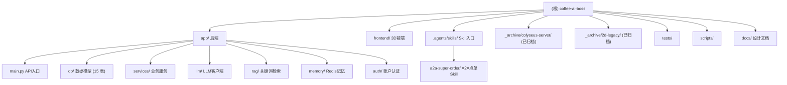

# Coffee AI Boss — 项目架构文档

> 本文档由初始化架构师自动生成于 2026-06-20，描述整个仓库的结构、模块职责与运行方式。
> 关于 CodeGraph 工具的使用说明，见 [`.claude/CLAUDE.md`](./.claude/CLAUDE.md)。

## 变更记录 (Changelog)

| 时间 | 动作 | 说明 |
|------|------|------|
| 2026-06-20 14:08 | 增量对齐（第四次 init） | **Skill 改造**：`.agents/skills/a2a-super-order/` 全量精读并**新建模块级 CLAUDE.md**（此前文档体系未覆盖该模块）。本次改动：① `scripts/order.py` 新增 `detect_username`（`getpass.getuser()`，跨平台系统账号名，修复旧 `platform.node()` 误用 hostname）/`detect_evomap_install`（只读检测 `~/.evomap/{node_id,node_secret}`，无副作用）/`load_evomap_credentials`（优先 `~/.evomap/` 文件 > `A2A_NODE_SECRET` > `EVOMAP_NODE_SECRET`）/`--check-evomap` 子命令；`register_if_needed` 接入凭证自动读取。② `SKILL.md` 新增 "EvoMap Installation Check"（未装→AI 引导用户二次确认后 `npx @evomap/evolver --loop`）+ NPX 安装说明 + 安全红线（只读检测安全；安装/注册/扣费必须用户明确确认；密钥 `redact_for_stdout` 脱敏）。③ `references/api.md` 同步 `--check-evomap` 文档。模块索引新增「A2A 超级点单 Skill」行，Mermaid 图补 `.agents/skills` 节点。覆盖率 98% → 99%。相关设计文档：`docs/EvoMap A2A Skill 脚本改造实施计划.md` |
| 2026-06-20 10:05 | 增量对齐（第三次 init） | **架构变更对齐**：09:40 起 `colyseus-server/` 与 2D 对话页（`app/static/index.html`）整体归档到 `_archive/`（`_archive/colyseus-server/`、`_archive/2d-legacy/`）。根 `/` 改为直出 3D SPA，Colyseus 子进程拉起为 no-op（目标目录不存在）。根 CLAUDE.md / index.json 的 Colyseus 节点标注 `status: archived` 并改链到 `_archive/colyseus-server/CLAUDE.md`；新增「架构演进」小节。补扫 Dashboard.tsx 全文、evomap_payment_service.py（支付证明脱敏/order_id 抽取）、skill_order_service.py（`_resume_existing_order` 幂等三态恢复 + `_reject_unverified_payment_proof`）；并校正数据模型实际为 15 张表（新增 Product/ProductOptionGroup/ProductOption/OrderItem/OrderItemOption/UserWallet/BalanceTransaction）+ wallet_service/catalog_service。覆盖率 97% → 98% |
| 2026-06-20 09:35 | 增量补扫 | 第二次 init：精读 office3d/ 全套 + sim/tick.ts + auth/AuthPages.tsx + docs/ 5 份设计文档全文，补全 A\*寻路/Agent 骨骼动画/表单实现/积分扣款链路细节，覆盖率 88% → 97% |
| 2026-06-20 | 创建 | 初始化架构师首次扫描，生成根级 + 4 个模块级 CLAUDE.md，覆盖率 ~88% |

---

## 项目愿景

**Coffee AI Boss（智能咖啡馆 AI 店长）** 是一个咖啡店运营模拟系统，核心是用 LLM + RAG + Redis 短期记忆驱动一段对话式点单体验，同时把订单、支付、Agent 行为以"3D 可视化事件流"的形式实时广播给 3D 咖啡厅场景与监控大屏。系统同时支持两条点单入口：

1. **Web 对话点单**（`POST /chat`）：匿名 `user_id` + Redis 短期记忆 + 两段式确认（先存待确认订单，回复"确认"才扣款）。UI 已统一进 3D 咖啡厅场景（`/3d/scene`），独立的 2D 对话页已归档。
2. **A2A Skill 点单**（`/skill/orders`）：EvoMap 消费者身份 + EvoMap 积分（service-order）扣款 + 免费额度账本。外部 AI 工具通过 `.agents/skills/a2a-super-order/` 的瘦客户端脚本（`order.py`）接入。

可视化基于"事件流"架构：所有业务动作（进店、下单、支付、制作、出餐）都生成一条 `VisualizationEvent` 写入 MySQL，并通过 WebSocket `/ws/visualization` 实时推给前端；**当前唯一活跃渲染管线是 3D 咖啡厅（`frontend/`，React-Three-Fiber）**。早期的像素风 Colyseus 多人房间方案已于 2026-06-20 09:40 归档（见下「架构演进」）。

---

## 架构总览

```
┌─────────────────────────────────────────────────────────────────┐
│                       前端（唯一活跃 UI）                          │
│  frontend/ (Vite + React 19 + React-Three-Fiber，3D 咖啡厅+大屏)   │
│  构建产物 → app/static/3d (由 FastAPI /3d 与根 / 托管)             │
└───────────────┬──────────────────────────────────┬──────────────┘
                │ HTTP /chat /skill/* /auth/*        │ WebSocket /ws/visualization
                ▼                                    ▼
┌─────────────────────────────────────────────────────────────────┐
│              FastAPI 后端 (app/main.py, Python)                   │
│  ┌──────────┐ ┌──────────┐ ┌──────────┐ ┌────────────────────┐   │
│  │ /chat    │ │ /skill/* │ │ /auth/*  │ │ /agents /actions   │   │
│  │ 对话点单  │ │ A2A点单   │ │ 账户登录  │ │ Agent 注册/动作     │   │
│  └────┬─────┘ └────┬─────┘ └────┬─────┘ └─────────┬──────────┘   │
│       │            ▲            │                 │              │
│       │   ┌────────┴─────────────┐                │              │
│       │   │ .agents/skills/      │                │              │
│       │   │ a2a-super-order/     │ (外部 AI 工具   │              │
│       │   │ order.py (瘦客户端)   │  瘦客户端入口)  │              │
│       │   └──────────────────────┘                │              │
│  ┌────▼───────────────────────────────────────────▼──────────┐   │
│  │  services/  chat_service · order_service                   │   │
│  │             skill_order_service · evomap_payment_service   │   │
│  │             visualization_service · wallet_service         │   │
│  │             catalog_service                                │   │
│  │  llm/ client (OpenAI 兼容)   rag/ keywords · retrieval     │   │
│  │  memory/ chat_history (Redis)  auth/ service (bcrypt)      │   │
│  │  colyseus_bridge.py (目标已归档，启动为 no-op，仅 debug 日志) │   │
│  └────┬───────────────────────────────────────┬───────────────┘   │
│       │                                        │                  │
└───────┼────────────────────────────────────────┼──────────────────┘
        ▼                                        ▼
┌──────────────────┐                  ┌────────────────────────┐
│   MySQL 8.0      │                  │  Redis 7               │
│ user / user_     │                  │ 对话历史 / 待确认订单     │
│ account / order /│                  └────────────────────────┘
│ order_item /     │
│ product /        │
│ coffee_kb /      │
│ agent_profile /  │
│ evomap_consumer /│
│ skill_order_     │
│   ledger /       │
│ user_wallet /    │
│ balance_txn /    │
│ visualization_   │
│   event (15 表)  │
└──────────────────┘
```

**关键设计原则**：
- **LLM 只负责"理解"和"说话"，绝不直接写库**：所有扣款/下单都在 `services` 层事务内完成（见 `app/llm/client.py` 注释）。
- **两段式下单**：`/chat` 先把待确认订单存 Redis，用户回复确认词才扣款，避免误下单。
- **事件溯源可视化**：业务动作 → `VisualizationEvent`（持久化）→ WebSocket 广播，前端可重放。
- **幂等下单**：`request_id` 唯一约束 + Skill 账本幂等恢复（`_resume_existing_order` 三态：已完成直返 / 待支付可重试 / 不可恢复抛错）。
- **支付证明不可客户端伪造**：后端拒绝客户端 `payment_proof`（`_reject_unverified_payment_proof`），必须由后端凭 `X-Evomap-Node-Secret` 发起官方 service order。
- **Skill 是瘦客户端**：`.agents/skills/a2a-super-order/` 只拼请求 + 管本地凭证状态，业务逻辑全在后端。

---

## 架构演进

| 时间 | 变更 | 现状 |
|------|------|------|
| 2026-06-20 09:40 | **Colyseus 像素多人房间方案弃用**：`colyseus-server/` 整目录归档到 [`_archive/colyseus-server/`](./_archive/colyseus-server/) | 可视化统一走后端 `/ws/visualization` 事件流 + 3D 咖啡厅。`app/colyseus_bridge.py` 仍在仓库（启动时检查 `colyseus-server/` 目录存在性，目录已移走后 `_COLYSEUS_DIR.is_dir()=False` → 仅记 warning 跳过，`bridge_event_to_colyseus` 仅 debug 日志），属"可恢复的停用"，**未删代码**。归档目录自带 `CLAUDE.md`：[`./_archive/colyseus-server/CLAUDE.md`](./_archive/colyseus-server/CLAUDE.md) |
| 2026-06-20 09:40 | **2D 原生对话页归档**：原 `app/static/index.html`（2D 聊天 UI）归档到 [`_archive/2d-legacy/index.html`](./_archive/2d-legacy/index.html) | 根路由 `/` 改为直出 3D SPA（`app/static/3d/index.html`，见 `app/main.py` `index()` 注释 "2D archived to _archive/2d-legacy/"）。`POST /chat` 仍作为 JSON API 存在，被 3D 场景内嵌聊天消费 |

> 决策动因：3D 咖啡厅方案（`frontend/src/office3d/`，移植自 Claw3D retro-office）的渲染表现力、Agent 表情/对话气泡/昼夜循环已全面覆盖像素风方案的能力，且事件流解耦使后端不依赖 Colyseus 权威状态同步。归档而非删除，保留可回溯与可恢复。

---

## 模块结构图



---

## 模块索引

| 模块 | 路径 | 语言 | 一句话职责 |
|------|------|------|-----------|
| [后端](./app/CLAUDE.md) | `app/` | Python (FastAPI) | 对话点单、A2A Skill 点单、可视化事件、账户认证的 API 与业务逻辑 |
| [3D 前端](./frontend/CLAUDE.md) | `frontend/` | TypeScript (React 19 + R3F) | 3D 咖啡厅场景渲染 + 实时监控大屏 + 登录注册（**唯一活跃 UI**） |
| [A2A 超级点单 Skill](./.agents/skills/a2a-super-order/CLAUDE.md) | `.agents/skills/a2a-super-order/` | Python (CLI, urllib) | 外部 AI 工具（Claude Code/Codex/Cursor/Trae）的**瘦客户端点单入口**：注册消费者、下点单、EvoMap 凭证自动读取、未装 EvoMap 时引导用户二次确认安装 |
| [Colyseus 服务器（已归档）](./_archive/colyseus-server/CLAUDE.md) | `_archive/colyseus-server/` | TypeScript (Colyseus) | **已弃用归档**。原像素咖啡馆多人房间，权威状态同步。2026-06-20 09:40 归档 |
| 2D 对话页（已归档） | `_archive/2d-legacy/` | HTML/CSS | **已弃用归档**。原 2D 聊天 UI（`index.html`），根 `/` 已改直出 3D SPA |
| 测试 | `tests/` | Python (unittest) | LLM 配置、确认意图、Skill 支付、订单查看的单元测试 |
| 脚本 | `scripts/` | Python | 建表/种子、订单来源迁移、账户表迁移 |
| 设计文档 | `docs/` | Markdown | A2A 积分接入、像素/3D 集成、点单 SKILL、Agent API 设计、Skill 脚本改造计划 |

---

## 设计文档（`docs/`）摘要

> 第二次扫描已精读全部设计文档，以下为关键决策与现状对照。

| 文档 | 核心内容 | 与代码的对应关系 |
|------|---------|----------------|
| `EvoMap A2A Skill 脚本改造实施计划.md` | **2026-06-20 新增**。基于 EvoMap 官方 wiki 全文调研 + 现有代码审计，提出 Skill 脚本侧 4 项 gap（系统账号名误用 hostname / 不查 `~/.evomap/` / 未装无引导 / 不读标准凭证存储）与可直接执行的实施计划；后端无需改动 | **已落地**：`scripts/order.py` 的 `detect_username`/`detect_evomap_install`/`load_evomap_credentials`/`--check-evomap`；`SKILL.md` 的 "EvoMap Installation Check"。见 [`.agents/skills/a2a-super-order/CLAUDE.md`](./.agents/skills/a2a-super-order/CLAUDE.md) |
| `EvoMap A2A 积分扣款接入调研与实现计划.md` | 把 `/chat` 的本地 `User.balance` 扣款改为通过 EvoMap 官方 `POST /a2a/service/order` 扣 Credits；价格模型默认"固定每单扣积分"；保留两段式确认；node_secret 只存本地 .env | 已落地：`app/services/evomap_payment_service.py`（`place_service_order` 用 stdlib `urllib` 调 Hub，`_extract_order_id` 多键兜底抽取，`_redact_response` 递归脱敏 secret/token/key/authorization；HTTP 401/402/429 透传，其余 ≥400 归 502）、`EVOMAP_*` 配置（`app/config.py`）。证据文件存 `C:\tmp\smart-search-evidence\20260619-evomap-a2a\` |
| `点单SKILL生成.md`（A2A 超级点单 Skill） | 唯一对外 Skill `.agents/skills/a2a-super-order/`；前两单免费（按 evomap_node_id 统计），第三单起必须真实扣 EvoMap 积分；无网页也能点单，事件持久化可回放 | 已落地：`POST /skill/register`、`POST /skill/orders`、`SkillOrderLedger`（free_order_sequence/payment_status/payment_proof_json）、`skill_order_service.py`。免费额账本：`consumer.free_orders_used` 单调递增，`_complete_order` 用 `max()` 防回退；`order.py` 是 Skill 主入口 |
| `agent-integration-api.md` | Agent 工具（Claude Code/Codex/Cursor/Trae）通过 REST 注册为餐厅角色，WS 实时新增像素人物+播动作；`agent_profile` 独立于 `user` 表 | 已落地：`POST /agents/register`（返回一次性 api_token，SHA-256 hash 存储）、`POST /agents/{id}/actions`、`/agents/{id}/heartbeat`、`GET /agents`。9 种 action_type / 8 种 target。**Schema Notes 强调**：MySQL 是唯一支持的 RDBMS；`order.source_type` 约束为 `web_dialog`/`skill`；`order.consumer_id/agent_id/ledger_id` 是物理外键；老库必须跑 `scripts/migrate_order_sources.py`（幂等）。**注意**：文档原写"实时像素人物"，实际渲染已切到 3D 咖啡厅 |
| `pixel-agents-integration.md` | 像素 Agent 集成方案（2D，已被 3D 取代的早期方案） | 仅作历史参考。像素 Colyseus 通道已整体归档（见「架构演进」）；当前可视化只走 3D 咖啡厅（`frontend/`）+ 后端 `/ws/visualization` |
| `pixel-restaurant-reference-repos.md` / `smart-search-pixel-restaurant-repos.md` | 像素餐厅参考仓库调研（含 Claw3D 等） | `frontend/src/office3d/` 即从 Claw3D retro-office 移植（文件头均注明）；调研结论演化为 3D 方案 |

---

## 运行与开发

### 环境依赖
- **Python ≥ 3.10**（代码用 `str | None` 语法，测试用 cpython-314 运行）
- **Node.js**（用于 3D 前端构建；Colyseus 已归档，无需独立 Node 服务）
- **MySQL 8.0** + **Redis 7**（推荐用 `docker compose up -d` 启动，见 `docker-compose.yml`）

### 后端启动
```bash
python -m venv .venv && .venv\Scripts\activate   # Windows
pip install -r requirements.txt
cp .env.example .env   # 填入 MySQL/Redis/LLM 配置
python scripts/init_db.py          # 建表 + 灌种子数据
uvicorn app.main:app --reload      # 启动 FastAPI
```
默认监听 `http://localhost:8000`。`COLYSEUS_PORT` 变量仍被 `colyseus_bridge.py` 读取，但因 `colyseus-server/` 已归档，启动为 no-op（仅 warning），不再占用端口。

### 3D 前端开发
```bash
cd frontend
npm install
npm run dev      # Vite 开发服务器，端口 5174，代理 /ws /api 到 8000
npm run build    # 产物输出到 app/static/3d，由 FastAPI 的 /3d 与根 / 路由托管
```

### A2A Skill 点单（外部 AI 工具）
```bash
python .agents/skills/a2a-super-order/scripts/order.py --check-evomap     # 只读检测 EvoMap 安装
python .agents/skills/a2a-super-order/scripts/order.py --message "一杯拿铁"  # 下单
```
详见 [`.agents/skills/a2a-super-order/CLAUDE.md`](./.agents/skills/a2a-super-order/CLAUDE.md)。

### 关键配置（`.env`，见 `app/config.py`）
| 变量 | 用途 | 默认 |
|------|------|------|
| `MYSQL_HOST/PORT/USER/PASSWORD/DATABASE` | 持久化数据库 | localhost/3306/coffee/coffee123/coffee_ai |
| `REDIS_HOST/PORT/DB/PASSWORD` | 短期记忆 + 待确认订单 | localhost/6379/0/空 |
| `LLM_API_KEY` / `DEEPSEEK_API_KEY` / `OPENAI_API_KEY` | OpenAI 兼容 LLM（三选一，按此顺序生效） | 空（降级为 RAG 模板） |
| `LLM_BASE_URL` / `LLM_MODEL` | LLM 服务地址与模型 | https://api.openai.com/v1 / gpt-4o-mini |
| `AUTH_SECRET_KEY` | 会话 Cookie 签名密钥（**生产必改**） | dev-only-change-me-in-prod |
| `SKILL_FREE_ORDER_LIMIT` | 每个 EvoMap 消费者免费下单次数 | 2 |
| `EVOMAP_PAYMENT_MODE` / `EVOMAP_SERVICE_LISTING_ID` / `EVOMAP_HUB_URL` | A2A 积分支付 | service_order / 空 / https://evomap.ai |

---

## 测试策略

- 框架：`unittest` + `fastapi.testclient.TestClient`
- 运行：`python -m pytest tests/` 或 `python -m unittest discover tests`
- 现有测试（4 个文件）：
  - `test_llm_configuration.py` — LLM key 多源别名与状态判定（placeholder 检测）
  - `test_chat_confirm.py` — `/chat` 两段式确认意图识别（长句确认 vs 修改/否定/提问）
  - `test_chat_order_view.py` — "查看订单"意图与"下单"的区分
  - `test_skill_evomap_payment.py` — Skill 点单 / EvoMap 积分支付流程
  - `verify_quick_menu.py` — 快捷菜单验证脚本
- **覆盖缺口**：缺少 `order_service.place_orders` 余额不足/并发、前端组件的自动化测试（Playwright 已装无测试）、`.agents/skills/a2a-super-order/` 脚本的自动化测试（CLI 仅靠 SKILL.md/examples 手测）。Colyseus 房间逻辑已随源码归档（`_archive/colyseus-server/`），不再计入活跃覆盖目标。

---

## 编码规范

- Python：类型注解（`from __future__ import annotations`），PEP 8 风格，中文 docstring 解释业务意图（很多文件带有面试题/任务编号注释，是设计文档的一部分，勿删）。
- TypeScript：`strict` 模式（见 `tsconfig.json`），React 19 函数组件 + Hooks。
- 命名：后端模块用 snake_case，前端组件用 PascalCase。
- 安全：Agent API token 用 SHA-256 hash 存储；账户密码用 bcrypt；会话 Cookie 用 `itsdangerous` 签名 + httponly + samesite-lax。
- EvoMap 响应在日志/返回前会 `_redact_response` 递归脱敏（key 含 secret/token/key/authorization → `[REDACTED]`）；Skill 脚本 `order.py` 同样用 `redact_for_stdout` 脱敏（→ `[stored-in-state]`）；node_secret 只存本地 .env 或 `~/.evomap/`（后者由 Evolver CLI 写入），不进 `.env.example`/Git/日志；客户端传来的 `payment_proof` 一律拒绝（`_reject_unverified_payment_proof`）。
- Skill 安全红线：`--check-evomap` 只读可自动运行；安装（`npx @evomap/evolver --loop`）/注册/扣 credits 必须用户明确确认。

---

## AI 使用指引

- **改后端业务逻辑前**，先读 `app/main.py` 的 `/chat` 流程注释（任务一/二/三），它完整描述了"读记忆 → 意图分类 → 四路咖啡解析 → 两段式确认"的决策树。
- **改点单/支付**：`order_service.place_orders` 用 `with_for_update()` 行锁防并发超扣；Skill 点单的幂等由 `SkillOrderLedger.request_id` 唯一约束保证，改流程时务必保留 `_resume_existing_order`（三态：FREE/PAID 直接成功重试；PAYMENT_REQUIRED/FAILED/PENDING 在有 node_secret 时重新扣款；其余抛 `ledger_not_resumable`）。
- **改 Skill 脚本**：业务逻辑不要塞进 `.agents/skills/a2a-super-order/`，脚本只拼请求；凭证读取务必走 `load_evomap_credentials`（文件优先 > 环境变量），密钥务必过 `redact_for_stdout`；新增敏感动作（安装/扣费）必须在 `SKILL.md` 写明二次确认要求。
- **改可视化事件**：事件类型若新增，需同时更新前端 `frontend/src/sim/roleMap.ts` 的 `ACTION_BEHAVIOR` 映射，否则前端无法渲染（未知 action 兜底为 `walk_to_table`）。
- **改 3D 渲染**：`office3d/` 全套移植自 Claw3D，坐标投影靠 `core/geometry.ts` 的 `toWorld` + `SCALE=0.018`；A\* 寻路在 `core/navigation.ts`（25px 网格，拐角裁剪）；改家具寻路行为调 `ITEM_METADATA.blocksNavigation/navPadding`。
- **LLM 降级**：所有 LLM 调用都有 `_mock_chat` / 兜底词降级，改动 prompt 时注意保持 JSON 输出格式（`parse_intent` 会 `_strip_code_fence`）。
- **Colyseus 已归档**：`app/colyseus_bridge.py` 保留但目标目录已移走，不要再依赖它做可视化；如需恢复像素方案，从 `_archive/colyseus-server/` 移回根目录即可。
- 不要修改 `.gitignore` 中忽略的生成物（`app/static/3d/assets/`、`node_modules/`、`__pycache__/`）。
- 仓库已索引 CodeGraph（`.codegraph/`），定位代码优先用 `codegraph explore`。

---

## 相关文件清单（根级）

| 文件 | 说明 |
|------|------|
| `docker-compose.yml` | MySQL 8.0 + Redis 7 容器编排 |
| `requirements.txt` | Python 依赖 |
| `.env.example` | 环境变量模板 |
| `AGENTS.md` / `GEMINI.md` | 各 AI 工具的项目说明 |
| `docs/` | 设计文档（见上方"设计文档摘要"表） |
| `.agents/skills/a2a-super-order/` | A2A 超级点单 Skill（见模块级 CLAUDE.md） |
| `_archive/` | 归档区：`colyseus-server/`（像素多人房间）、`2d-legacy/`（2D 对话页），可追溯可恢复 |
